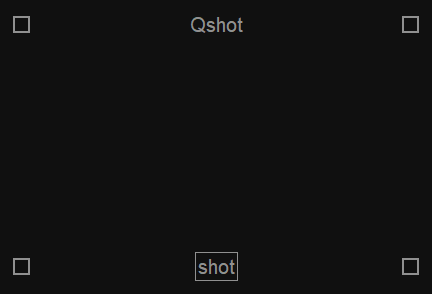
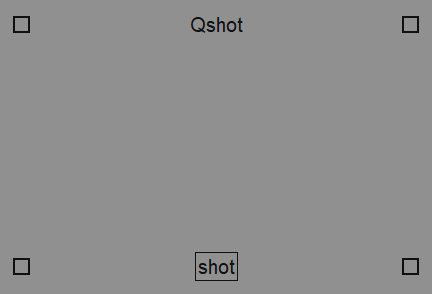
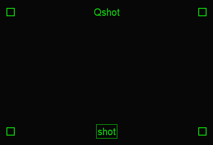
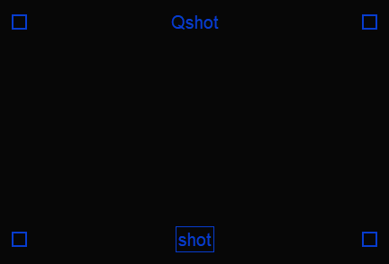
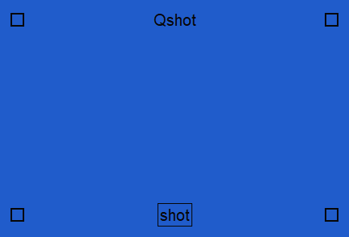
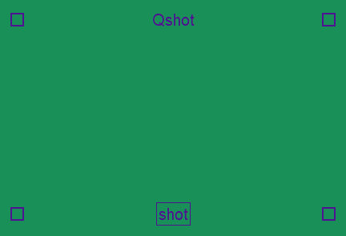
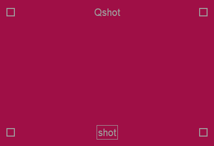
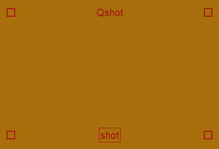
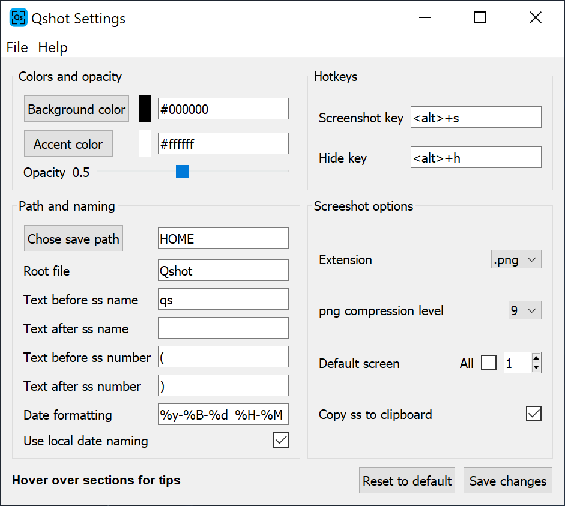
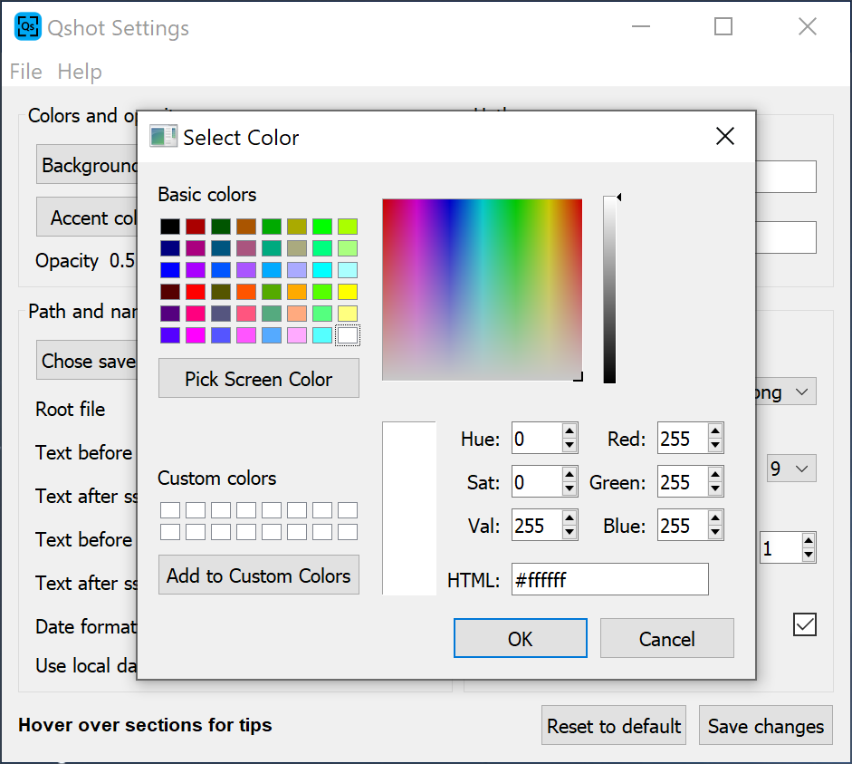

# Quickshot
#### A simple, portable, customizable screenshot tool.
___

   

## Check out [Quickshot website](https://cccaaannn.github.io/Quickshot)

## Features
- **Fast**, no more choosing save path or name every time.
- **Easy to use**, simple ui single button.
- **Customizable**, check [Settings](#Settings).
- **Portable**, all required files in one folder on a path that you choose. check [versions](#versions).

 

## Custom color Quickshot examples

 

 

 

 

## Settings
Quickshot has several customization options.

- Background, accent color and opacity customization.
- Hotkey customization.
- Multi screen support for full screen screenshots.
- Clipboard support.
- Screenshot save customizations
    - Save name and path.
    - Options for screenshot numbering.
    - Date formatting.
    - Locale date naming.
    - jpg and png support.

 

 
 

## Versions

## Windows
- win32 installer
    - This version has an **option** for adding shortcut to context menu, if selected you can not move the installation folder.
- msix installer
    - msix packages needs to use another folder for saving settings since they can not be changed, this version saves settings to `C:\Users\USER\.Quickshot`.
- portable
    - Portable version without installer.

## Linux

- AppImage | [appimage.org](https://appimage.org/)
    - AppImages needs to use another folder for saving settings since they can not be changed, this version saves settings to `/HOME/USER/.Quickshot`.
    - Extra dependencies
        - Clipboard function requires [xclip](https://github.com/astrand/xclip) to be installed on Linux.
    - Known issues
        - Scaling display causes coordinate problems on screenshots on kde plasma but works on gnome 🤷🏻‍♂️.  
        - Some long animations causes Quickshot's frame to be visible on screenshots, use `Window invisibility time` option for delaying screenshot (or disable display compositor). 
