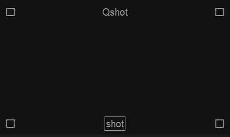
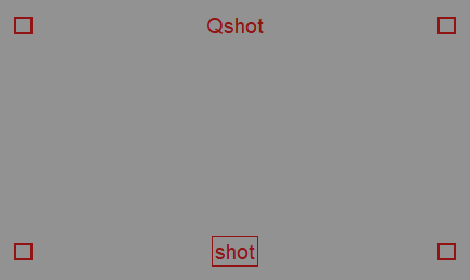
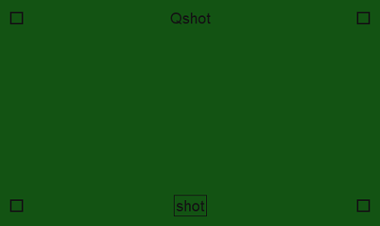
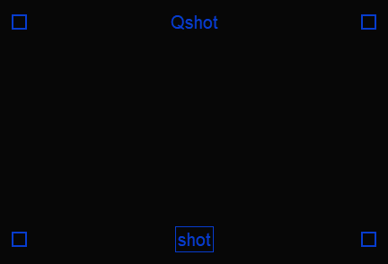
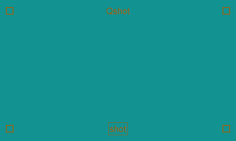
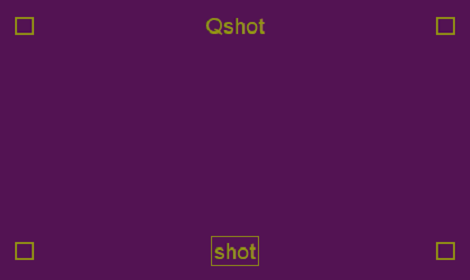
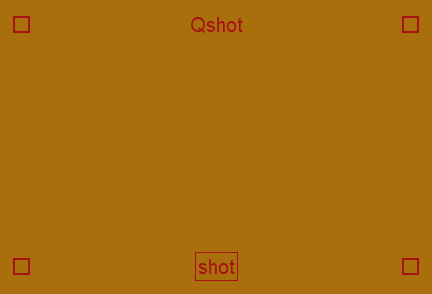
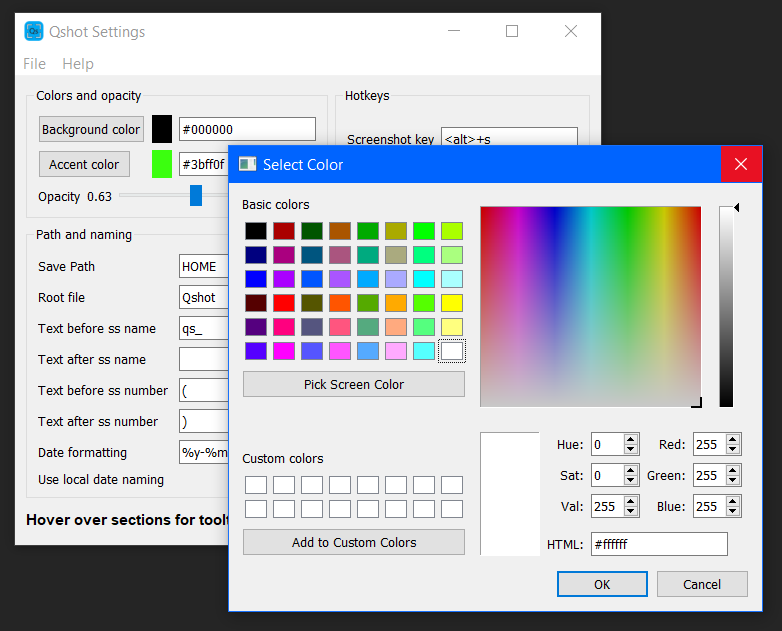
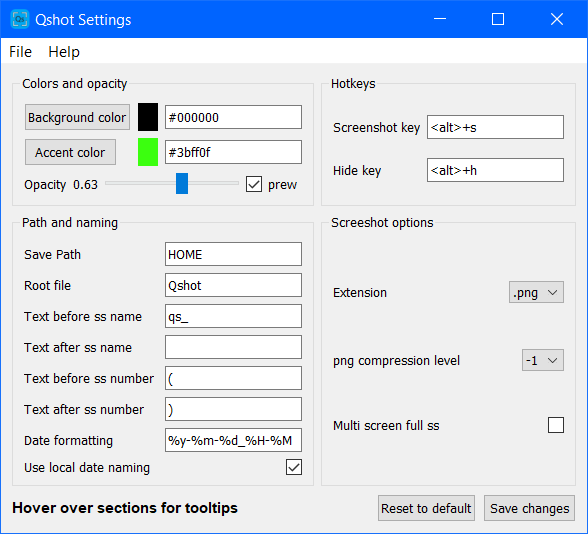

# Quickshot
#### A simple, quick, customizable screenshot tool.
___

  

## Features
- **Fast**, no more choosing save path or name every time.
- **Easy to use**, simple ui single button.
- **Customizable**, see [Settings](#Settings).
- **Portable**, all required files in one folder on a path that you choose. No registry bullshit.

 

## Custom color Quickshot examples

 

 

 

 

## Settings
Quickshot has several customization options.

- Background, accent color and opacity.
- Hotkey customization.
- Save path. ('HOME' finds user home or any path)
- Several options for screenshot name.
- Date formatting customization for screenshot name. (datetime module style)
- Locale date naming.
- Screenshot extension. (png or jpg) 
- Multi screen support for full screen screenshots.

 

 

