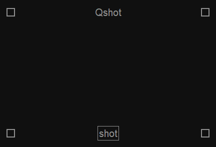
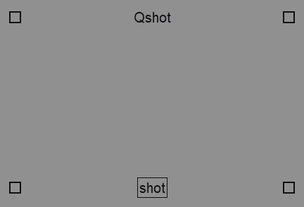
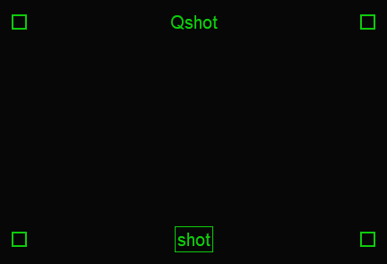
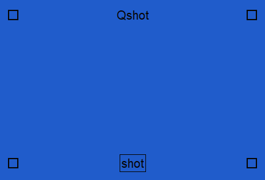
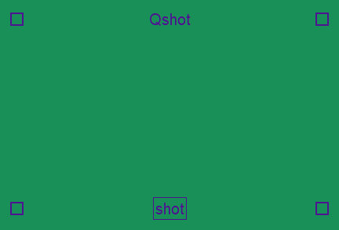
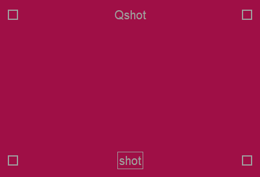
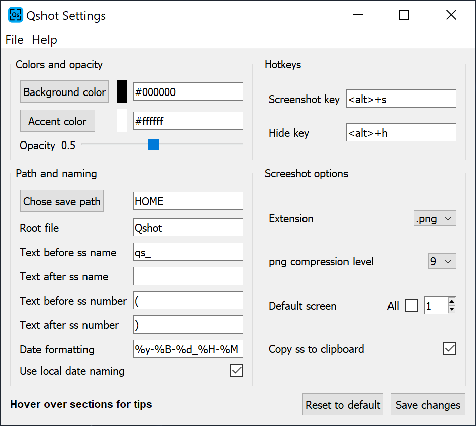
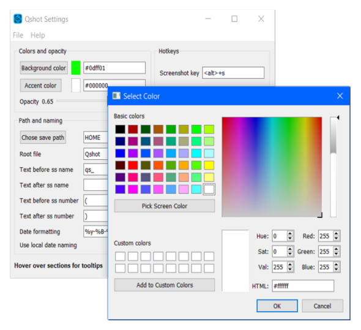

# Quickshot
#### A simple, quick, customizable screenshot tool.
___

   

## Features
- **Fast**, no more choosing save path or name every time.
- **Easy to use**, simple ui single button.
- **Customizable**, see [Settings](#Settings).
- **Portable**, all required files in one folder on a path that you choose. No registry bullshit.

 

## Custom color Quickshot examples

 

 

 

 

## Settings
Quickshot has several customization options.

- Background, accent color and opacity customization.
- Hotkey customization.
- Multi screen support for full screen screenshots.
- Clipboard support for screenshots.
- Screenshot options.
    - Save name and path options.
    - Options for screenshot numbers.
    - Date formatting customization.
    - Locale date naming.
    - jpg or png extension support.

 

 

